# 🏨 HỆ THỐNG QUẢN LÝ KHÁCH SẠN PTIT


**Hệ thống quản lý khách sạn toàn diện - Bài tập lớn môn Internet và Giao thức**

[](https://www.python.org/)
[](https://flask.palletsprojects.com/)
[](https://www.mysql.com/)
[](LICENSE)

</div>

---

## 📋 MÔ TẢ DỰ ÁN

Hệ thống Quản lý Khách sạn PTIT là một ứng dụng web toàn diện được phát triển bằng **Python Flask** và **MySQL**, tích hợp đầy đủ các chức năng quản lý vận hành khách sạn hiện đại. Dự án được xây dựng với kiến trúc **MVC**, bảo mật cao, giao diện thân thiện và khả năng mở rộng tốt.

### 🎯 Mục tiêu dự án

- ✅ Tự động hóa quy trình quản lý đặt phòng, check-in/check-out
- ✅ Tích hợp thanh toán điện tử qua QR code (VietQR)
- ✅ Giao tiếp real-time giữa khách hàng và nhân viên
- ✅ Quản lý nhân sự, chấm công, tính lương/thưởng
- ✅ Hệ thống khách hàng thân thiết với tích điểm và voucher
- ✅ Báo cáo, thống kê doanh thu trực quan

### 👥 Đối tượng sử dụng

| Vai trò | Mô tả | Quyền hạn |
|---------|-------|-----------|
| **🔐 Admin** | Quản trị viên hệ thống | Toàn quyền truy cập, quản lý nhân viên, phân quyền, cấu hình hệ thống |
| **👔 Nhân viên** | Nhân viên lễ tân/quản lý | Đặt phòng, check-in/out, quản lý dịch vụ, xem báo cáo (theo phân quyền) |
| **👤 Khách hàng** | Khách hàng của khách sạn | Đặt phòng online, chat với lễ tân, quản lý tài khoản, tích điểm |

### 🌟 Điểm nổi bật

- 🏗️ **Kiến trúc MVC**: Code structure rõ ràng, dễ bảo trì và mở rộng
- 🔒 **Bảo mật cao**: RBAC đa cấp, mã hóa mật khẩu, CSRF protection, session management
- 💬 **Chat Real-time**: WebSocket-based messaging với upload file
- 💳 **Thanh toán QR**: Tích hợp VietQR cho thanh toán nhanh, an toàn
- 📧 **Email tự động**: SMTP integration với HTML templates responsive
- 📱 **Responsive Design**: Hoạt động mượt mà trên desktop, tablet, mobile
- 📊 **Dashboard trực quan**: Thống kê real-time, biểu đồ, xuất báo cáo
- 🎁 **Loyalty Program**: Tích điểm, voucher tự động, khuyến mãi
- ⚡ **Performance**: Connection pooling, caching, compression


---

## 🚀 CHỨC NĂNG CHÍNH

### 1. 🏨 Quản lý Phòng & Loại phòng

#### Sơ đồ phòng trực quan
- 📊 Hiển thị real-time trạng thái tất cả phòng
- 🎨 Mã màu phân biệt trạng thái:
  - 🟢 **Xanh lá**: Phòng trống (available)
  - 🔵 **Xanh dương**: Đã đặt trước (booked)
  - 🔴 **Đỏ**: Đang có khách (occupied)
  - 🟣 **Tím**: Quá giờ checkout (overdue)
- 🔍 Lọc theo trạng thái và loại phòng
- 💡 Tooltip hiển thị thông tin chi tiết khi hover

#### Quản lý loại phòng
- 🏷️ 4 loại phòng: **Tiêu chuẩn, Superior, Deluxe, Suite**
- 👥 Cấu hình số người tối đa (1-5 người/phòng)
- 💰 Quản lý giá theo từng loại
- 📝 Mô tả chi tiết cho mỗi loại phòng
- 🎫 Tùy chọn tặng voucher cho loại phòng VIP

### 2. 📅 Đặt phòng Đa kênh

#### Đặt phòng Offline (Nhân viên)
- 📋 Form nhập thông tin khách hàng đầy đủ
- 📅 Calendar picker chọn ngày nhận/trả phòng
- ⏰ Hỗ trợ thuê theo **ngày** hoặc **giờ**
- 💵 Tính toán tiền cọc tự động (30% tổng tiền)
- 🔄 Kiểm tra phòng trống tự động
- ✉️ Gửi email xác nhận tự động

#### Đặt phòng Online (Khách hàng)
- 🌐 Giao diện thân thiện cho khách hàng
- 🔐 Đăng nhập/Đăng ký tài khoản khách hàng
- 📱 QR code thanh toán tiền cọc ngay
- ⏱️ Session timeout 5 phút cho bảo mật
- ✅ Yêu cầu xác nhận từ nhân viên
- 📧 Thông báo email theo từng bước

#### Quản lý Booking chờ
- 📝 Danh sách booking online chờ xác nhận
- ✅ Phê duyệt hoặc từ chối với lý do
- 🔔 Thông báo đến khách hàng qua email
- 📊 Thống kê tỷ lệ chấp nhận/từ chối

### 3. 🏢 Check-in / Check-out

#### Nhận phòng (Check-in)
- ✅ Xác thực thông tin đặt phòng
- 💳 Thanh toán tiền cọc (nếu chưa đặt cọc online)
- 🔑 Cập nhật trạng thái phòng sang "Đang ở"
- 📧 Email chào mừng với thông tin phòng
- 🎁 Tặng voucher cho khách VIP

#### Trả phòng (Check-out)
- 🧾 Tính tổng chi phí (phòng + dịch vụ)
- ⏰ Tính phụ phí nếu quá giờ checkout
- 💰 Thanh toán cuối cùng
- 🎫 Tự động tạo voucher giảm giá lần sau
- 📊 Cập nhật điểm tích lũy cho khách hàng
- ✉️ Email cảm ơn kèm hóa đơn

#### Gia hạn phòng
- ⏰ Gia hạn thêm ngày/giờ
- 💵 Tính toán chi phí bổ sung
- 📧 Email xác nhận gia hạn

### 4. 💳 Thanh toán & Hóa đơn

#### Phương thức thanh toán
- 💵 **Tiền mặt**: Thanh toán trực tiếp tại quầy
- 📱 **QR Code**: Chuyển khoản qua VietQR
  - Tạo QR tự động với số tiền chính xác
  - Nội dung chuyển khoản có mã đặt phòng
  - Xác nhận thanh toán thủ công bởi nhân viên

#### Quản lý thanh toán
- ⏱️ **Session timeout**: 5 phút cho mỗi session thanh toán
- 🔐 Token bảo mật cho mỗi giao dịch
- 📋 Danh sách thanh toán chưa hoàn tất
- ♻️ Tự động hủy session hết hạn
- 📊 Lịch sử thanh toán đầy đủ

#### Hóa đơn điện tử
- 🧾 Hóa đơn đặt cọc, dịch vụ, trả phòng
- 📄 In PDF hoặc gửi email
- 💼 Lưu trữ lâu dài trong hệ thống
- 📊 Báo cáo tổng hợp hóa đơn

### 5. 🛎️ Dịch vụ Khách sạn

#### Quản lý dịch vụ
- 🍽️ **Ăn uống**: Nhà hàng, room service
- 👔 **Giặt ủi**: Giặt khô, ủi đồ
- 💆 **Spa**: Massage, chăm sóc sức khỏe
- 🎯 **Dịch vụ khác**: Tour, xe đưa đón...

#### Đặt dịch vụ
- 📝 Khách đặt dịch vụ cho phòng đang ở
- 📱 QR code trong phòng để đặt dịch vụ nhanh
- 💰 Tính phí tự động
- 🧾 Thanh toán riêng hoặc gộp vào bill phòng

### 6. 💬 Chat Real-time

#### Giao tiếp khách hàng - nhân viên
- ⚡ **WebSocket**: Chat thời gian thực không delay
- 📤 **Upload file**: Gửi ảnh, tài liệu, video
- 📱 **QR code**: Quét QR trong phòng để chat
- 🔔 **Thông báo**: Badge hiển thị tin nhắn chưa đọc
- 💾 **Lịch sử**: Lưu trữ toàn bộ cuộc hội thoại
- 👁️ **Trạng thái**: Hiển thị đã xem/chưa xem

#### Tính năng nâng cao
- � Tìm kiếm tin nhắn theo nội dung
- 📁 Quản lý file đính kèm
- 👥 Chat theo phòng/booking

### 7. 📧 Email Marketing & Thông báo

#### Hệ thống email tự động
- ✅ **Xác nhận đặt phòng**: Gửi ngay sau khi đặt
- 🎉 **Chào mừng**: Email khi check-in
- 🙏 **Cảm ơn**: Email sau check-out kèm voucher
- 📋 **Hóa đơn**: Gửi hóa đơn điện tử
- 🎫 **Voucher**: Mã giảm giá cho lần tiếp theo
- ⏰ **Nhắc nhở**: Nhắc trước ngày check-in

#### Cấu hình SMTP
- 📮 Hỗ trợ Gmail, Outlook, SMTP tùy chỉnh
- 🔐 Bảo mật với App Password
- ✉️ HTML templates responsive đẹp mắt
- 📊 Lịch sử email đã gửi
- 📈 Thống kê tỷ lệ gửi thành công

### 8. 🎁 Loyalty Program

#### Tích điểm khách hàng
- ⭐ **100,000 VNĐ = 1 điểm**
- 💰 **1 điểm = 1% giảm giá**
- 📊 Theo dõi điểm tích lũy real-time
- 🏆 Xếp hạng khách hàng thân thiết

#### Voucher tự động
- 🎫 **Tạo tự động** sau mỗi lần check-out
- 💯 **Tỷ lệ giảm giá**: 10% (có thể cấu hình)
- 📅 **Thời hạn**: 60 ngày (có thể cấu hình)
- 🔢 **Mã unique**: Không trùng lặp
- ✅ **Áp dụng**: Khi đặt phòng lần sau
- 📊 **Thống kê**: Theo dõi tỷ lệ sử dụng voucher

### 9. 👥 Quản lý Nhân viên

#### Phân quyền RBAC (Role-Based Access Control)
- 🔐 **Vai trò hệ thống**: Admin, Nhân viên
- 🎭 **Vai trò tùy chỉnh**: Tạo role mới với permissions riêng
- 🔑 **Quyền chi tiết**: Quản lý từng chức năng cụ thể
- 👤 **Quyền cá nhân**: Gán quyền đặc biệt cho từng user
- 🛡️ **Bảo mật**: Admin luôn có full access

#### Chấm công
- ⏰ **Check-in hàng ngày**: Nhân viên tự chấm công
- ✅ **Phê duyệt**: Admin xét duyệt chấm công
- 📊 **Lịch sử**: Xem lịch sử chấm công theo tháng
- 📈 **Báo cáo**: Thống kê ngày công

#### Quản lý lương thưởng
- 💰 **Lương cơ bản**: Theo hợp đồng
- 💵 **Phụ cấp**: Các khoản phụ cấp khác
- 🎁 **Thưởng doanh thu**: Theo % doanh thu tháng
- 📊 **Bậc thưởng**: Cấu hình nhiều mức doanh thu
- 🧾 **Bảng lương**: Xem chi tiết lương hàng tháng

### 10. 📊 Báo cáo & Thống kê

#### Dashboard tổng quan
- 📈 **Check-in/out hôm nay**: Số lượng real-time
- 🏨 **Phòng có khách**: Tỷ lệ lấp đầy
- 💬 **Tin nhắn mới**: Thông báo chat chưa đọc
- 📅 **Booking sắp tới**: Lịch đặt phòng
- 💰 **Doanh thu hôm nay**: Tổng thu nhập

#### Thống kê doanh thu
- 📊 **Biểu đồ**: Bar chart theo tháng/năm
- 💵 **Tổng doanh thu**: Phòng + Dịch vụ + Cọc
- 📈 **So sánh**: Tăng/giảm so với kỳ trước
- 🏆 **Top loại phòng**: Doanh thu cao nhất
- 📅 **Theo khoảng thời gian**: Filter tùy chỉnh
- 📥 **Xuất Excel/PDF**: Download báo cáo

#### Thống kê khách hàng
- 👥 **Tổng khách**: Số lượng khách hàng
- 🔄 **Khách quay lại**: Tỷ lệ retention
- 💰 **Chi tiêu trung bình**: Average spending
- 🏆 **Top khách hàng**: Theo doanh thu
- 📊 **Phân tích hành vi**: Booking patterns

### 11. ⚙️ Cấu hình Hệ thống

#### Email Settings
- 📮 SMTP server, port, username, password
- 🔐 SSL/TLS encryption
- ✉️ Email người gửi và tên hiển thị
- 🧪 Test email connection

#### Voucher Settings
- 💯 Tỷ lệ giảm giá mặc định (%)
- 📅 Số ngày hết hạn voucher
- 🎁 Điều kiện nhận voucher

#### Salary Settings
- 💰 Cấu hình các bậc thưởng theo doanh thu
- 📊 Phần trăm thưởng cho từng bậc
- 🔄 Áp dụng cho tất cả nhân viên

#### Quản lý vai trò
- 🎭 Tạo/sửa/xóa vai trò
- 🔑 Gán permissions cho vai trò
- 👤 Gán vai trò cho nhân viên
- 📋 Danh sách permissions có sẵn

### 12. 👤 Khách hàng Self-service

#### Tài khoản khách hàng
- 📝 **Đăng ký**: Tạo tài khoản mới
- 🔐 **Đăng nhập**: Username/password hoặc Google OAuth
- 🔑 **Quên mật khẩu**: Reset qua email
- 👤 **Thông tin cá nhân**: Cập nhật profile
- 🏆 **Điểm tích lũy**: Xem điểm hiện tại
- 🎫 **Voucher của tôi**: Danh sách voucher

#### Đặt phòng online
- 🔍 Tìm phòng theo ngày và loại
- 💰 Xem giá và chi tiết phòng
- 📱 QR code thanh toán tiền cọc
- 📧 Email xác nhận
- 📊 Lịch sử đặt phòng

#### Chat với lễ tân
- � Chat trực tiếp với nhân viên
- 📤 Gửi ảnh, file
- 📱 Quét QR trong phòng để chat ngay

---

## 🛠️ CÔNG NGHỆ SỬ DỤNG

### Backend Framework
```
🐍 Python 3.8+               - Ngôn ngữ lập trình chính
🌶️  Flask 3.0.0              - Web framework micro, linh hoạt
🗄️  Flask-SQLAlchemy 3.1.1   - ORM cho database operations
🔐 Flask-Login 0.6.3         - User session management
⚡ Flask-SocketIO            - WebSocket cho chat real-time
💾 Flask-Caching 2.1.0       - Caching layer tối ưu performance
📦 Flask-Compress 1.13       - HTTP response compression
🔄 Flask-Migrate 4.0.5       - Database migrations
🔑 Authlib 1.3.2             - OAuth2 authentication
```

### Database & Storage
```
🗄️  MySQL 5.7+               - Relational database
🐬 PyMySQL 1.1.0             - MySQL driver cho Python
🔗 Connection Pooling        - Pool size: 10, Max overflow: 20
📊 15 Tables                 - Schema được tối ưu hóa
🔍 Indexes                   - Để tăng tốc queries
```

### Data Processing & Reports
```
🐼 pandas                    - Data manipulation và analysis
📊 openpyxl                  - Xuất file Excel
📄 reportlab 4.2.0           - Tạo file PDF
📈 Chart.js                  - Biểu đồ interactive (frontend)
```

### Utilities & Tools
```
⏰ APScheduler 3.10.4        - Background job scheduling
📱 qrcode[pil] 7.4.2         - Tạo QR code cho thanh toán
✉️  smtplib (built-in)        - Gửi email SMTP
🔐 werkzeug.security         - Password hashing
🌍 python-dotenv 1.0.1       - Environment variables
🔧 unicodedata               - Xử lý chuỗi tiếng Việt
```

### Frontend Technologies
```
🎨 HTML5                     - Semantic markup
💅 CSS3                      - Custom styles, animations
⚡ JavaScript (ES6+)         - DOM manipulation, async/await
🎭 Font Awesome 6.4.0        - Icon library
📅 FullCalendar              - Calendar widget cho booking
🔔 Toast Notifications       - User feedback
```

### Development Tools
```
🔧 Git                       - Version control
📝 VS Code                   - IDE (recommended)
🐛 Chrome DevTools           - Debugging
📮 Postman                   - API testing
```

---

## 📸 SCREENSHOTS - GIAO DIỆN HỆ THỐNG

<details>
<summary><b>🔐 1. Trang đăng nhập</b></summary>

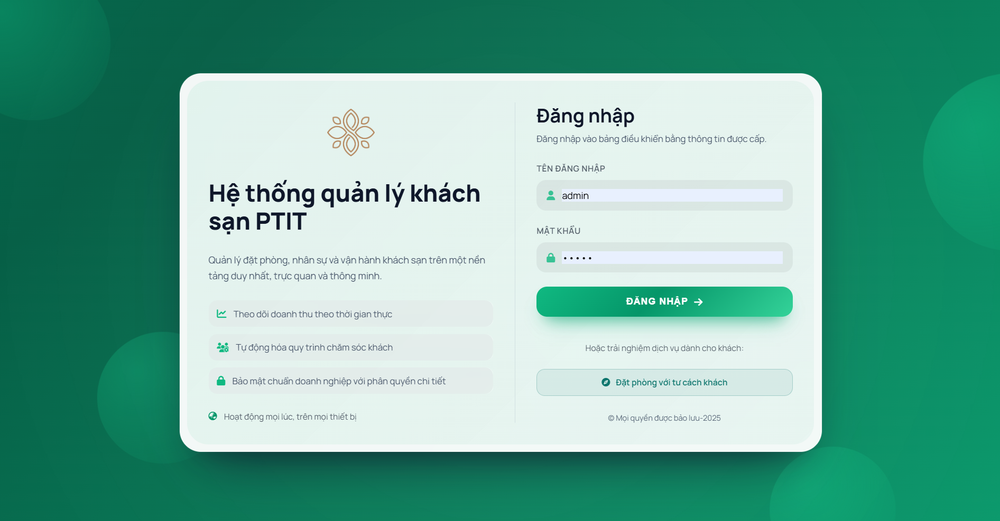

**Mô tả**: Giao diện đăng nhập với form validation và responsive design. Hỗ trợ đăng nhập cho cả nhân viên và admin.

</details>

<details>
<summary><b>📊 2. Dashboard tổng quan</b></summary>

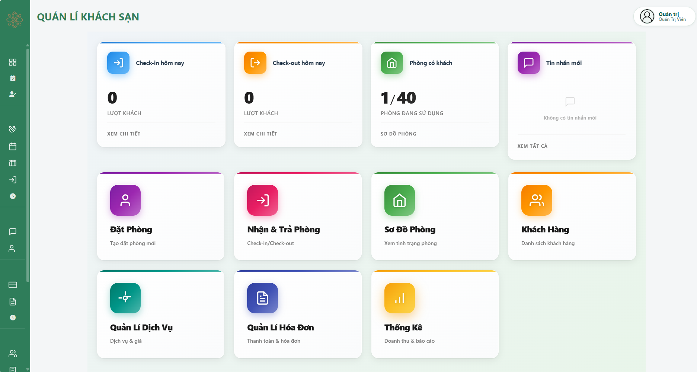

**Mô tả**: Trang chủ hiển thị các thống kê chính - Check-in/out hôm nay, Phòng có khách, Tin nhắn mới với số lượng real-time.

</details>

<details>
<summary><b>🏨 3. Sơ đồ phòng</b></summary>

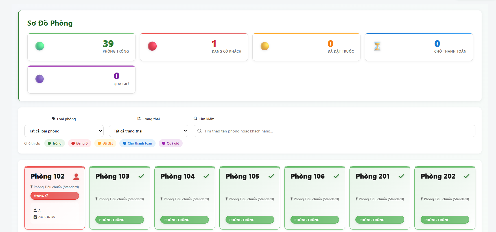

**Mô tả**: Hiển thị trực quan trạng thái tất cả phòng với màu sắc phân biệt. Xanh lá (trống), Xanh dương (đã đặt), Đỏ (đang ở), Tím (quá giờ).

</details>

<details>
<summary><b>📅 4. Đặt phòng offline</b></summary>

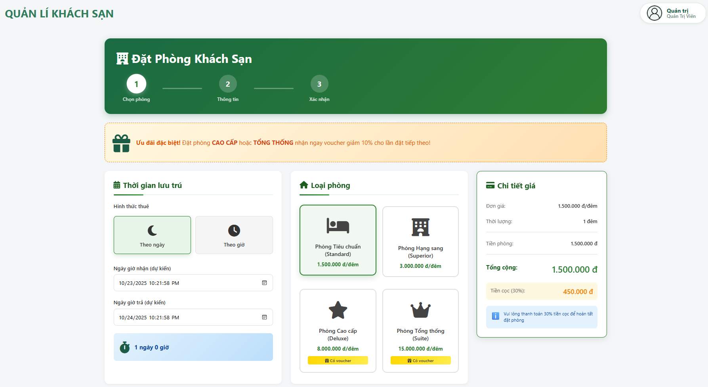

**Mô tả**: Form đặt phòng cho nhân viên với calendar picker và tính tiền tự động. Hỗ trợ thuê theo ngày hoặc giờ.

</details>

<details>
<summary><b>🌐 5. Đặt phòng online</b></summary>

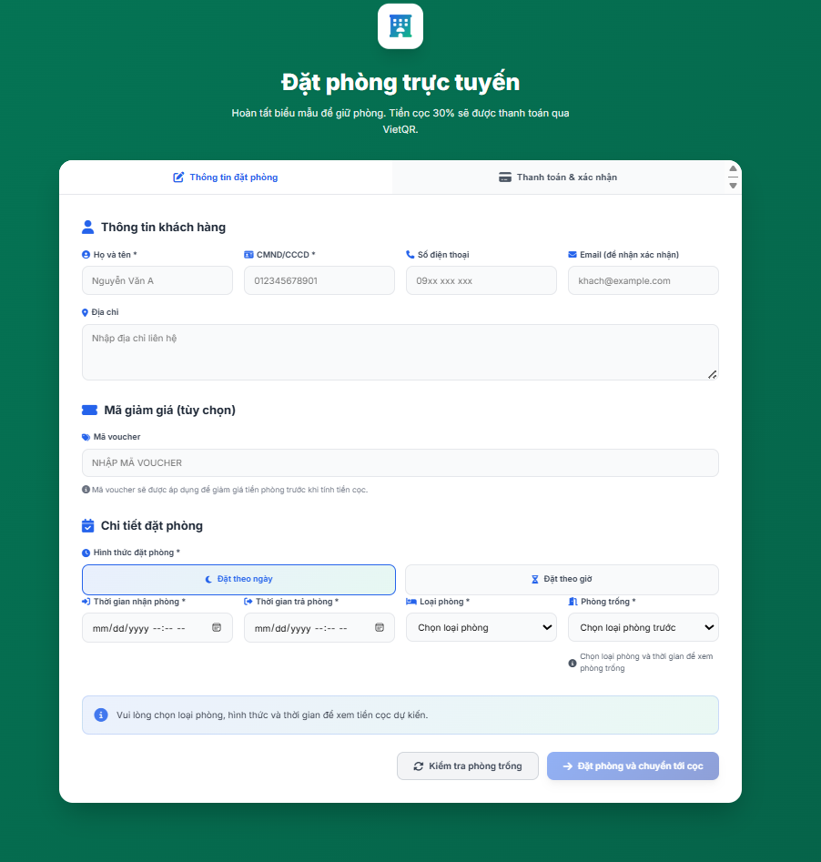

**Mô tả**: Giao diện khách hàng tự đặt phòng với QR code thanh toán tiền cọc online.

</details>

<details>
<summary><b>💬 6. Chat real-time</b></summary>

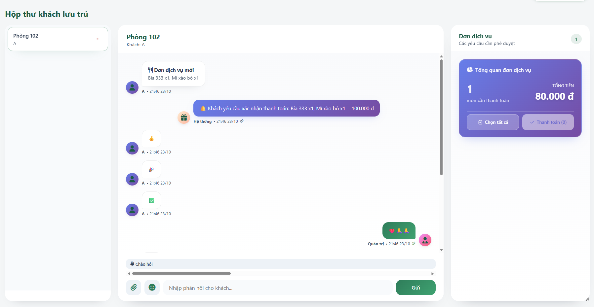

**Mô tả**: Giao diện chat giữa khách hàng và nhân viên với hỗ trợ upload file (ảnh, tài liệu, video).

</details>

<details>
<summary><b>👥 7. Quản lý nhân viên</b></summary>


**Mô tả**: Danh sách nhân viên với thông tin chi tiết, avatar, và các chức năng quản lý chấm công, lương thưởng.

</details>

<details>
<summary><b>📈 8. Thống kê doanh thu</b></summary>

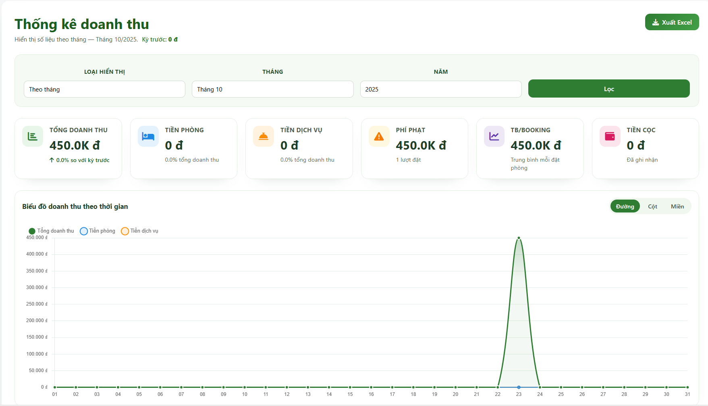

**Mô tả**: Biểu đồ doanh thu theo tháng/năm với khả năng xuất báo cáo Excel/PDF.

</details>

<details>
<summary><b>⏰ 9. Chấm công</b></summary>

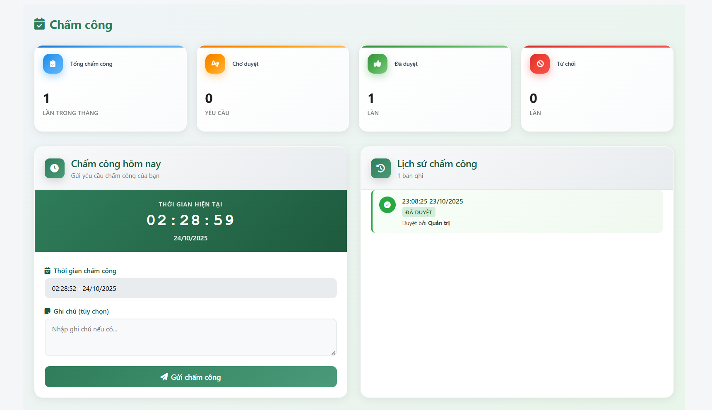

**Mô tả**: Giao diện chấm công hàng ngày cho nhân viên với lịch sử chấm công.

</details>

<details>
<summary><b>✅ 10. Phê duyệt chấm công</b></summary>

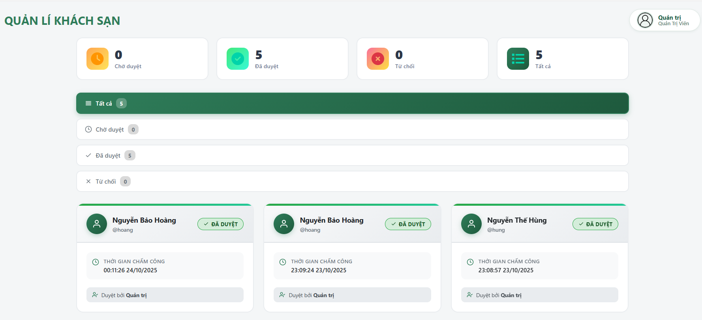

**Mô tả**: Admin phê duyệt hoặc từ chối các yêu cầu chấm công của nhân viên với ghi chú.

</details>

<details>
<summary><b>📋 11. Đặt phòng online chờ xác nhận</b></summary>

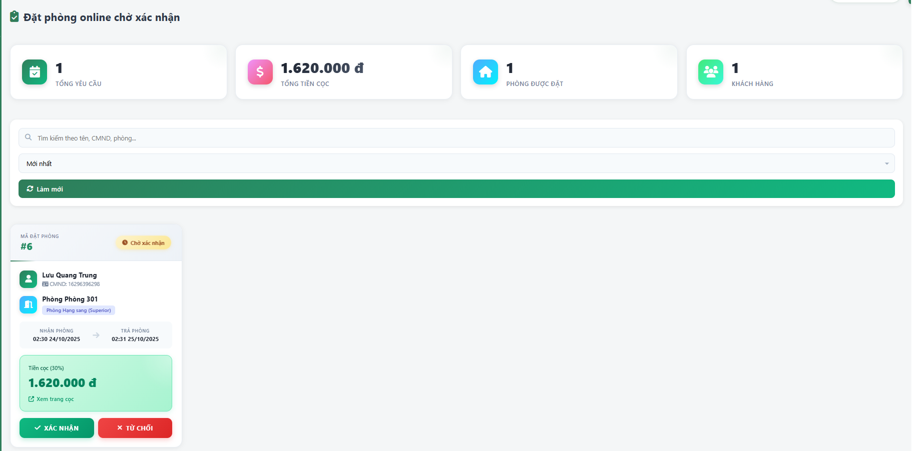

**Mô tả**: Danh sách các booking online đang chờ xác nhận từ nhân viên với countdown timer.

</details>

<details>
<summary><b>🛎️ 12. Dịch vụ và thanh toán</b></summary>

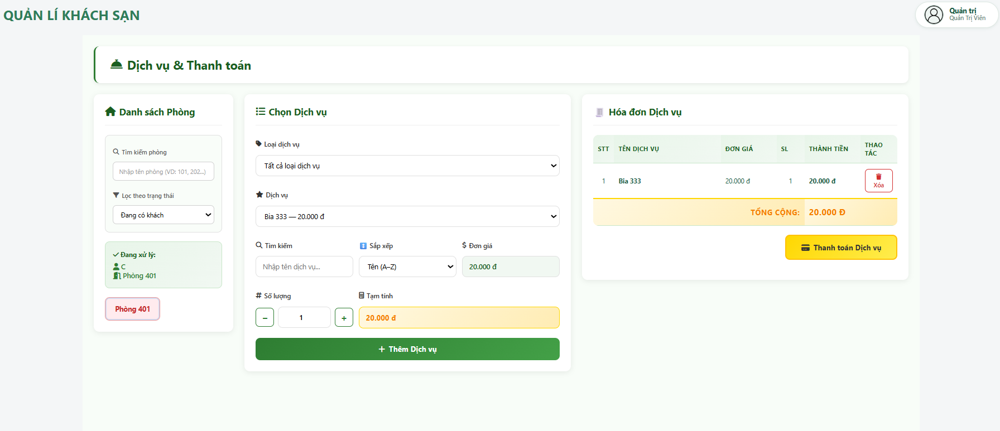

**Mô tả**: Giao diện hiển thị các dịch vụ khách hàng có thể sử dụng tại khách sạn (Ăn uống, Giặt ủi, Spa...).

</details>

<details>
<summary><b>📧 13. Lịch sử email</b></summary>


**Mô tả**: Theo dõi và quản lý các email đã gửi tự động cho khách hàng với trạng thái gửi.

</details>

<details>
<summary><b>💳 14. Thanh toán chưa hoàn tất</b></summary>

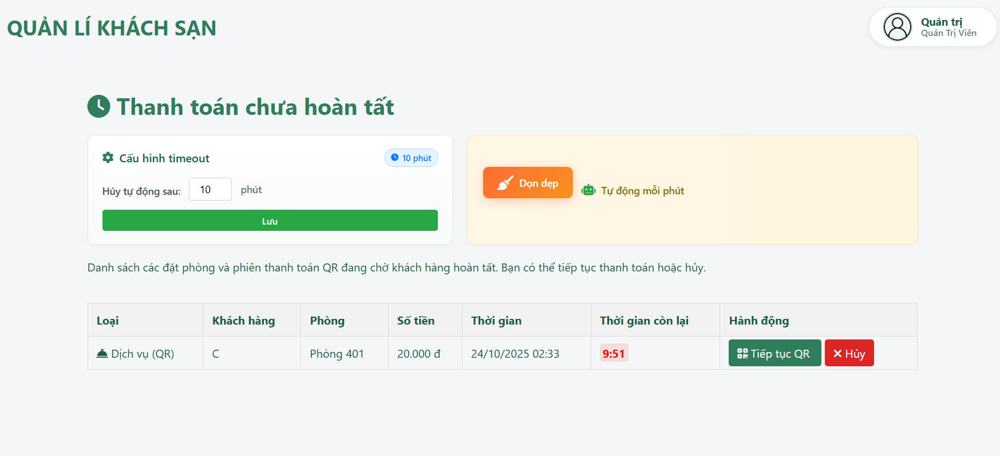

**Mô tả**: Danh sách các session thanh toán đang pending hoặc chưa hoàn tất với thời gian còn lại.

</details>

<details>
<summary><b>❌ 15. Giao diện 404</b></summary>

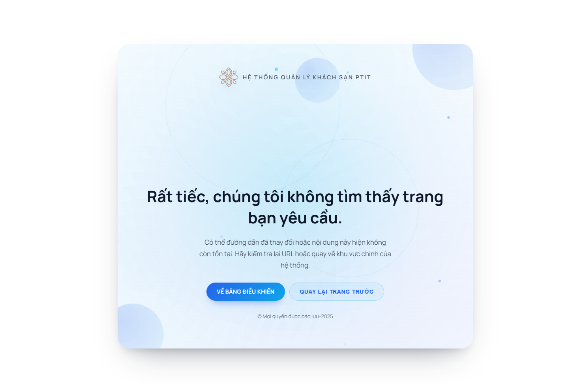

**Mô tả**: Trang lỗi 404 thân thiện khi truy cập đường dẫn không tồn tại trong hệ thống.

</details>

<details>
<summary><b>🙏 16. Giao diện cảm ơn</b></summary>

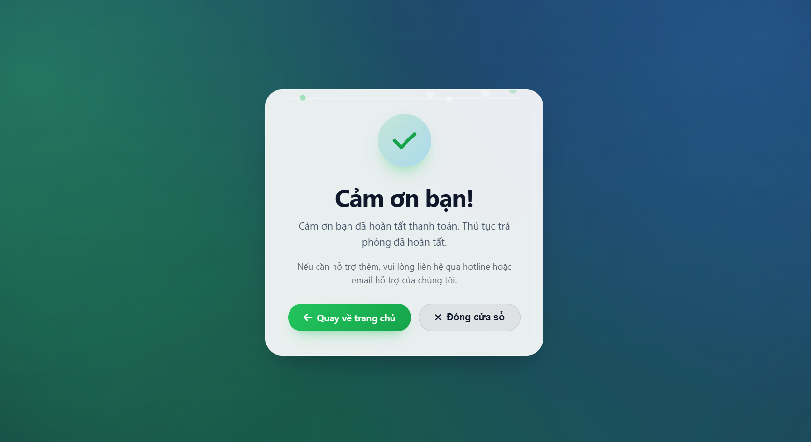

**Mô tả**: Trang cảm ơn sau khi hoàn tất đặt phòng hoặc thanh toán thành công.

</details>

<details>
<summary><b>⚙️ 17. Quản lý dịch vụ</b></summary>

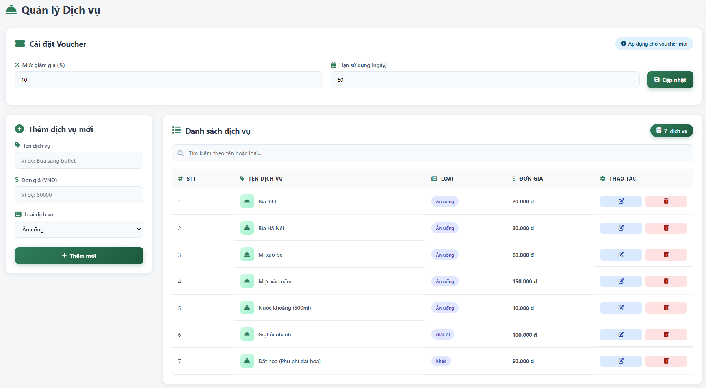

**Mô tả**: Admin quản lý các dịch vụ bổ sung - thêm, sửa, xóa, cập nhật giá cả.

</details>

<details>
<summary><b>👤 18. Hồ sơ cá nhân</b></summary>

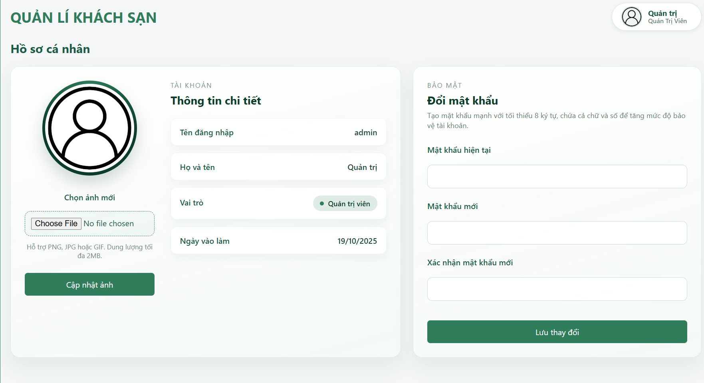

**Mô tả**: Thông tin cá nhân của nhân viên với avatar, thông tin liên hệ và khả năng cập nhật.

</details>

<details>
<summary><b>💰 19. Lương và thưởng cá nhân</b></summary>

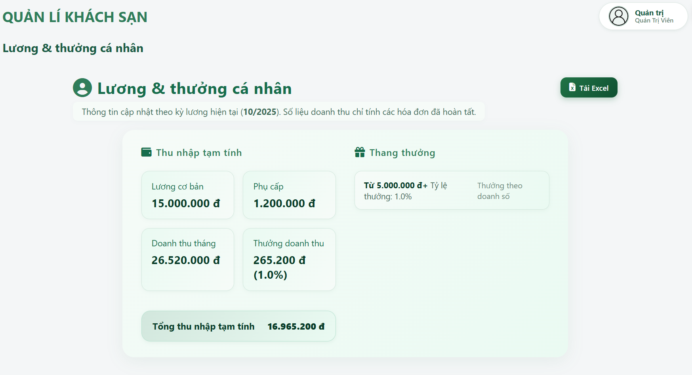

**Mô tả**: Xem chi tiết lương cơ bản, phụ cấp và thưởng theo doanh thu của từng tháng.

</details>

<details>
<summary><b>🔑 20. Nhận và trả phòng</b></summary>

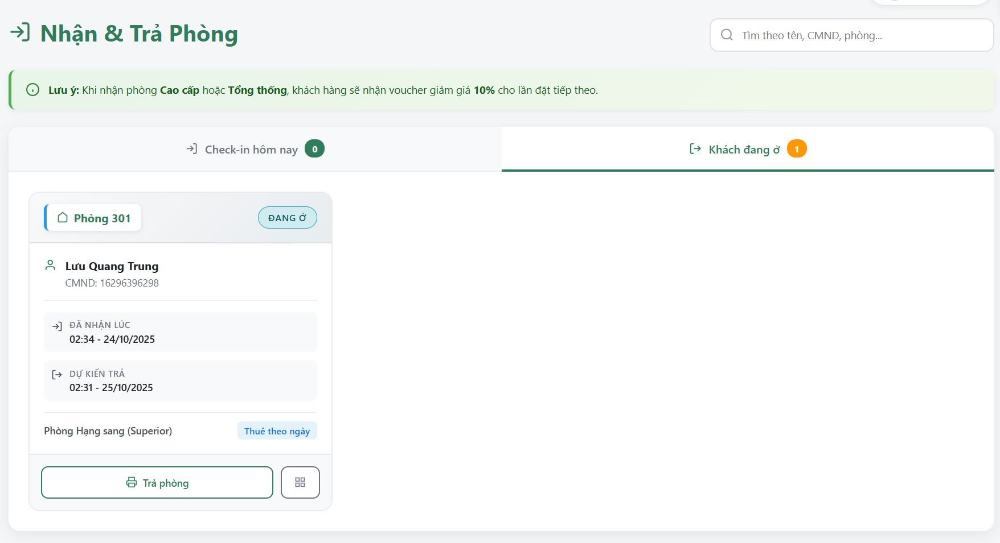

**Mô tả**: Giao diện check-in và check-out cho khách hàng với tính toán chi phí tự động.

</details>

<details>
<summary><b>📱 21. Quét QR xác nhận thanh toán</b></summary>

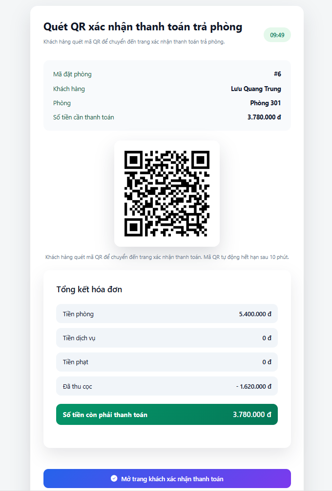

**Mô tả**: Khách hàng quét QR code VietQR để thanh toán chuyển khoản online nhanh chóng.

</details>

<details>
<summary><b>🧾 22. Thanh toán trả phòng</b></summary>

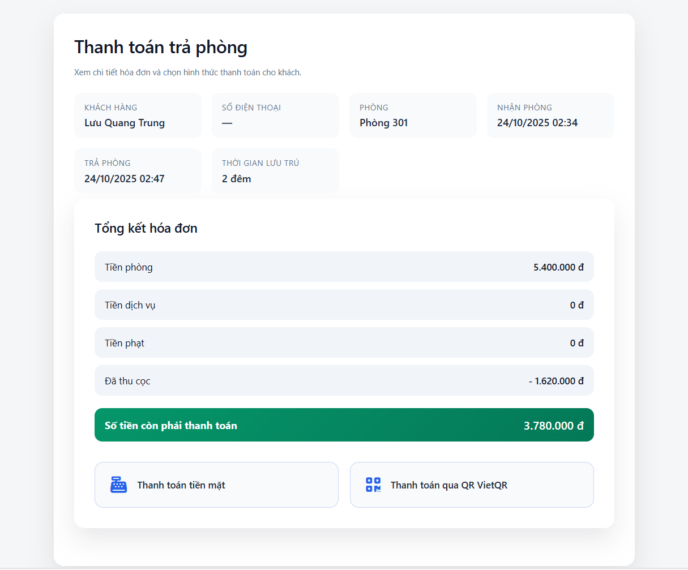

**Mô tả**: Thanh toán cuối cùng khi trả phòng với tổng chi phí bao gồm phòng và dịch vụ.

</details>

<details>
<summary><b>📄 23. Hóa đơn thanh toán</b></summary>

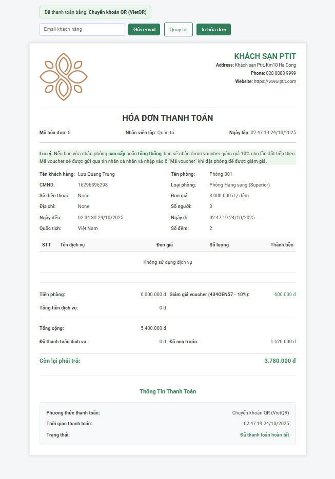

**Mô tả**: Hiển thị chi tiết hóa đơn thanh toán với khả năng in PDF hoặc gửi email.

</details>

<details>
<summary><b>🔐 24. Đăng nhập khách hàng</b></summary>

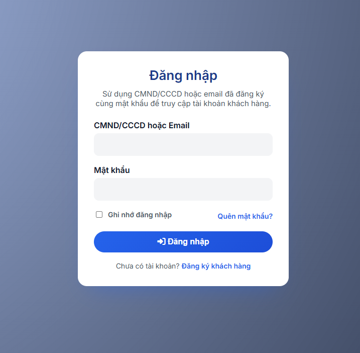

**Mô tả**: Giao diện đăng nhập riêng cho khách hàng với tùy chọn đăng ký tài khoản mới.

</details>

<details>
<summary><b>🏠 25. Trang khách hàng</b></summary>

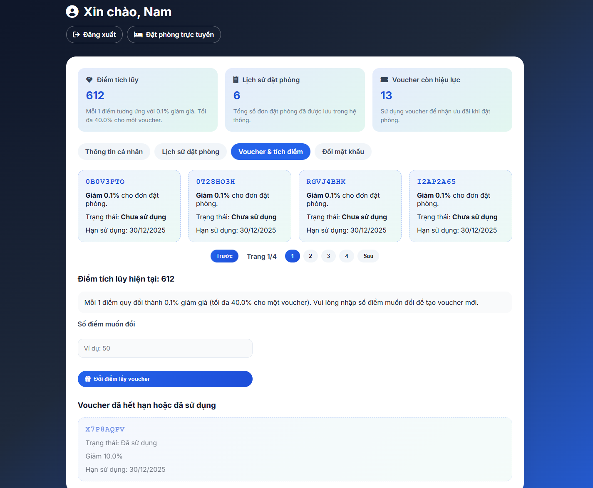

**Mô tả**: Giao diện chính cho khách hàng với các chức năng đặt phòng online, xem lịch sử, quản lý voucher.

</details>

---

## 💻 CÀI ĐẶT VÀ CHẠY ỨNG DỤNG

### 📋 Yêu cầu hệ thống

| Phần mềm | Phiên bản tối thiểu | Ghi chú |
|----------|---------------------|---------|
| **Python** | 3.8+ | Khuyến nghị 3.9 hoặc 3.10 |
| **MySQL** | 5.7+ | Hoặc MariaDB 10.2+ |
| **pip** | Latest | Python package installer |
| **Git** | Latest | Để clone repository |
| **Browser** | Chrome 90+, Firefox 88+, Edge 90+ | Modern browsers |

### 🚀 Các bước cài đặt

#### **Bước 1: Clone Repository**

```bash
git clone https://github.com/keyznam-jpg/BTL-Internet.git
cd BTL-Internet
```

#### **Bước 2: Tạo môi trường ảo (Virtual Environment)**

**Windows:**
```cmd
python -m venv venv
venv\Scripts\activate
```

**Linux/MacOS:**
```bash
python3 -m venv venv
source venv/bin/activate
```

> 💡 **Lưu ý**: Luôn kích hoạt virtual environment trước khi làm việc với project!

#### **Bước 3: Cài đặt Dependencies**

```bash
pip install --upgrade pip
pip install -r requirements.txt
```

**Kiểm tra cài đặt thành công:**
```bash
pip list
```

#### **Bước 4: Thiết lập MySQL Database**

**4.1. Tạo database:**
```sql
CREATE DATABASE IF NOT EXISTS Internet CHARACTER SET utf8mb4 COLLATE utf8mb4_unicode_ci;
```

**4.2. Import schema:**

**Windows (PowerShell):**
```powershell
Get-Content schema_internet.sql | mysql -u root -p Internet
```

**Linux/MacOS:**
```bash
mysql -u root -p Internet < schema_internet.sql
```

**4.3. Kiểm tra database:**
```sql
USE Internet;
SHOW TABLES;
-- Nên có 15 tables
```

#### **Bước 5: Cấu hình biến môi trường**

Tạo file `.env` trong thư mục gốc của project:

```env
# ===== DATABASE CONFIGURATION =====
MYSQL_HOST=localhost
MYSQL_PORT=3306
MYSQL_USER=root
MYSQL_PASSWORD=your_mysql_password
MYSQL_DB=Internet

# ===== SECURITY =====
SECRET_KEY=your_very_secret_and_random_key_here_at_least_32_characters

# ===== EMAIL CONFIGURATION (Optional) =====
SMTP_SERVER=smtp.gmail.com
SMTP_PORT=587
SMTP_USERNAME=your_email@gmail.com
SMTP_PASSWORD=your_app_specific_password
SUPPORT_EMAIL=support@yourdomain.com

# ===== GOOGLE OAUTH (Optional) =====
GOOGLE_CLIENT_ID=your_google_client_id
GOOGLE_CLIENT_SECRET=your_google_client_secret

# ===== PUBLIC URL (Optional) =====
PUBLIC_BASE_URL=http://localhost:5000
```

> 🔐 **Bảo mật**: 
> - **Không** commit file `.env` lên Git!
> - Sử dụng App Password cho Gmail, không dùng mật khẩu thật
> - Tạo SECRET_KEY ngẫu nhiên: `python -c "import secrets; print(secrets.token_hex(32))"`

#### **Bước 6: Cấu hình Gmail SMTP (Tùy chọn)**

Nếu muốn sử dụng tính năng gửi email tự động:

1. Truy cập: https://myaccount.google.com/security
2. Bật "2-Step Verification"
3. Tạo "App Password" cho ứng dụng
4. Dùng App Password này trong file `.env`

#### **Bước 7: Chạy ứng dụng**

**Cách 1: Chạy trực tiếp**
```bash
python app.py
```

**Cách 2: Sử dụng Flask CLI**
```bash
set FLASK_APP=app.py
set FLASK_ENV=development
flask run
```

**Cách 3: Sử dụng file batch (Windows)**
```cmd
run.bat
```

**Ứng dụng sẽ chạy tại:** http://127.0.0.1:5000 hoặc http://localhost:5000

#### **Bước 8: Truy cập hệ thống**

🌐 **Mở trình duyệt và truy cập:**
- **Nhân viên/Admin**: http://localhost:5000/login
- **Khách hàng**: http://localhost:5000/khach-hang/dang-nhap

---

## 👤 TÀI KHOẢN MẶC ĐỊNH

### 🔐 Admin Account
```
Username: admin
Password: admin
Role: Quản trị viên (Full Access)
```

### 👔 Nhân viên Accounts
```
Username: nam      | Password: 123
Username: hoang    | Password: 123
Username: hung     | Password: 123
Role: Nhân viên (Limited Access)
```

> ⚠️ **Lưu ý quan trọng**: 
> - Đổi mật khẩu admin ngay sau lần đăng nhập đầu tiên
> - Không sử dụng mật khẩu mặc định trong môi trường production

---

## 🗺️ CẤU TRÚC PROJECT

```
BTL-Internet-main/
│
├── 📄 app.py                          # Main application file (10,686 lines)
├── 📄 models.py                       # Database models (SQLAlchemy)
├── 📄 requirements.txt                # Python dependencies
├── 📄 schema_internet.sql             # Database schema (538 lines)
├── 📄 run.bat                         # Windows batch file để chạy app
├── 📄 .env                            # Environment variables (không commit)
├── 📄 README.md                       # File này
├── 📄 GIOI_THIEU_CHUC_NANG_CHI_TIET.md  # Hướng dẫn chi tiết
├── 📄 HUONG_DAN_QUAN_LY_LOAI_PHONG.md   # Hướng dẫn quản lý loại phòng
├── 📄 add_co_voucher_column.sql       # Migration script
│
├── 📁 static/                         # Static files (CSS, JS, Images)
│   ├── 📁 img/                        # Images, icons, logos
│   ├── 📁 uploads/                    # User uploaded files
│   │   ├── 📁 avatars/                # Avatar images
│   │   └── 📁 chat/                   # Chat attachments
│   ├── 📄 style.css                   # Main stylesheet
│   ├── 📄 booking.css                 # Booking page styles
│   ├── 📄 dashboard.css               # Dashboard styles
│   ├── 📄 email_settings.css          # Email settings styles
│   ├── 📄 employee.css                # Employee management styles
│   ├── 📄 login.css                   # Login page styles
│   ├── 📄 payments.css                # Payment styles
│   ├── 📄 room_map.css                # Room map styles
│   ├── 📄 salary.css                  # Salary management styles
│   ├── 📄 service.css                 # Service styles
│   ├── 📄 payments.js                 # Payment JavaScript
│   └── 📄 voucher_check.js            # Voucher validation
│
├── 📁 templates/                      # HTML templates (Jinja2)
│   ├── 📄 base.html                   # Base layout template
│   ├── 📄 dashboard.html              # Dashboard page
│   ├── 📄 login.html                  # Staff login page
│   ├── 📄 404.html                    # Error 404 page
│   │
│   ├── 📄 so_do_phong.html            # Room map
│   ├── 📄 dat_phong.html              # Offline booking
│   ├── 📄 dat_phong_online.html       # Online booking
│   ├── 📄 quan_ly_dat_phong_online.html  # Manage online bookings
│   ├── 📄 quan_ly_booking_cho.html    # Pending bookings
│   ├── 📄 nhan_phong.html             # Check-in/out
│   ├── 📄 gia_han_phong.html          # Room extension
│   ├── 📄 quan_li_phong.html          # Room management
│   ├── 📄 quan_li_loai_phong.html     # Room type management
│   │
│   ├── 📄 thanh_toan_phong.html       # Room payment
│   ├── 📄 thanh_toan_coc.html         # Deposit payment
│   ├── 📄 thanh_toan_dv.html          # Service payment
│   ├── 📄 thanh_toan_chua_hoan_tat.html  # Incomplete payments
│   ├── 📄 payment_confirm.html        # Payment confirmation
│   ├── 📄 qr_room.html                # Room payment QR
│   ├── 📄 qr_deposit.html             # Deposit QR
│   ├── 📄 qr_service.html             # Service QR
│   ├── 📄 cam_on.html                 # Thank you page
│   │
│   ├── 📄 hoa_don.html                # Room invoice
│   ├── 📄 hoa_don_coc.html            # Deposit invoice
│   ├── 📄 hoa_don_dv.html             # Service invoice
│   ├── 📄 quan_li_hoa_don.html        # Invoice management
│   │
│   ├── 📄 dichvu_thanhtoan.html       # Services & payments
│   ├── 📄 quan_li_dich_vu.html        # Service management
│   │
│   ├── 📄 tin_nhan.html               # Messages/Chat
│   ├── 📄 chat_khach.html             # Customer chat
│   ├── 📄 qr_code_chat.html           # Chat QR code
│   │
│   ├── 📄 khach_hang.html             # Customer list
│   ├── 📄 khach_hang_dang_ky.html     # Customer registration
│   ├── 📄 khach_hang_dang_nhap.html   # Customer login
│   ├── 📄 khach_hang_quen_mat_khau.html  # Password reset
│   ├── 📄 khach_hang_tai_khoan.html   # Customer account
│   ├── 📄 dat_phong_online.html       # Customer booking page
│   ├── 📄 dat_coc_online.html         # Online deposit
│   ├── 📄 quan_ly_tai_khoan_khach_hang.html  # Customer account management
│   │
│   ├── 📄 nhan_vien.html              # Employee list
│   ├── 📄 nhan_vien_chi_tiet.html     # Employee details
│   ├── 📄 thong_tin_ca_nhan.html      # Personal profile
│   ├── 📄 attendance.html             # Employee attendance
│   ├── 📄 attendance_admin.html       # Attendance approval
│   ├── 📄 work_days.html              # Work days calendar
│   ├── 📄 luong_thuong.html           # Salary & bonus
│   ├── 📄 cai_dat_luong_thuong.html   # Salary settings
│   │
│   ├── 📄 quan_ly_vai_tro.html        # Role management
│   ├── 📄 cai_dat_email.html          # Email settings
│   ├── 📄 lich_su_email.html          # Email history
│   ├── 📄 chi_tiet_email.html         # Email details
│   │
│   ├── 📄 thong_ke_doanh_thu.html     # Revenue statistics
│   ├── 📄 thong_ke_khach.html         # Customer statistics
│   ├── 📄 access_pending.html         # Access pending page
│   │
│   └── 📁 partials/                   # Partial templates
│       ├── 📄 role_list_items.html
│       ├── 📄 role_detail.html
│       ├── 📄 salary_employee_list.html
│       ├── 📄 salary_stats_grid.html
│       └── 📄 salary_tier_list.html
│
├── 📁 screenshots/                    # Demo screenshots (25 images)
│   ├── 📷 login.png
│   ├── 📷 dashboard.png
│   ├── 📷 room_map.png
│   └── ... (22 more images)
│
├── 📁 Avatar/                         # Default avatars
├── 📁 __pycache__/                    # Python cache (auto-generated)
└── 📁 Phần mềm cần cài đặt/           # Installation guides
```

### 📊 Database Schema (15 Tables)

```
┌──────────────────┐
│      role        │  ← Vai trò hệ thống
├──────────────────┤
│  nguoidung       │  ← Nhân viên/Admin
│  role_permission │  ← Quyền của vai trò
│  user_permission │  ← Quyền cá nhân
├──────────────────┤
│  loaiphong       │  ← Loại phòng
│  phong           │  ← Phòng
├──────────────────┤
│  khachhang       │  ← Khách hàng
│  datphong        │  ← Đặt phòng
│  voucher         │  ← Voucher giảm giá
├──────────────────┤
│  dichvuloai      │  ← Loại dịch vụ
│  dichvu          │  ← Dịch vụ
│  sudungdv        │  ← Sử dụng dịch vụ
├──────────────────┤
│  tinnhan         │  ← Tin nhắn chat
│  payment_session │  ← Session thanh toán
├──────────────────┤
│  attendance      │  ← Chấm công
│  luongnhanvien   │  ← Lương nhân viên
│  luongthuongcauhinh │  ← Cấu hình lương thưởng
├──────────────────┤
│  hethongcauhinh  │  ← Cấu hình hệ thống
│  emailtemplate   │  ← Template email
│  email_log       │  ← Lịch sử email
└──────────────────┘
```

---

## 🔗 API ROUTES & ENDPOINTS

### 🔐 Authentication Routes
```
GET  /login                          - Trang đăng nhập nhân viên
POST /login                          - Xử lý đăng nhập
GET  /logout                         - Đăng xuất

GET  /khach-hang/dang-ky             - Đăng ký khách hàng
POST /khach-hang/dang-ky             - Xử lý đăng ký
GET  /khach-hang/dang-nhap           - Đăng nhập khách hàng
POST /khach-hang/dang-nhap           - Xử lý đăng nhập khách
GET  /khach-hang/dang-nhap/google    - OAuth Google login
GET  /khach-hang/dang-xuat           - Đăng xuất khách hàng
GET  /khach-hang/quen-mat-khau       - Quên mật khẩu
POST /khach-hang/quen-mat-khau       - Xử lý reset password
```

### 📊 Dashboard & Overview
```
GET  /                               - Redirect to dashboard or login
GET  /dashboard                      - Dashboard tổng quan
```

### 🏨 Room Management
```
GET  /so-do-phong                    - Sơ đồ phòng
GET  /quan-li-phong                  - Quản lý phòng
GET  /quan-li-loai-phong             - Quản lý loại phòng
POST /quan-li-loai-phong             - Thêm/sửa loại phòng
```

### 📅 Booking Management
```
GET  /dat-phong                      - Trang đặt phòng offline
POST /dat-phong                      - Xử lý đặt phòng

GET  /dat-phong-online               - Khách hàng đặt phòng online
POST /dat-phong-online               - Xử lý đặt online
GET  /dat-phong-online/<token>/dat-coc  - Đặt cọc online
POST /dat-phong-online/<token>/yeu-cau-xac-nhan  - Yêu cầu xác nhận

GET  /quan-ly-dat-phong-online       - Quản lý booking online
POST /quan-ly-dat-phong-online/<id>/xac-nhan  - Xác nhận booking
POST /quan-ly-dat-phong-online/<id>/tu-choi   - Từ chối booking

GET  /quan-ly-booking-cho            - Booking chờ xử lý
POST /quan-ly-booking-cho/<id>/tu-choi  - Từ chối booking chờ

GET  /nhan-phong                     - Check-in/out page
POST /nhan-phong                     - Xử lý check-in/out

GET  /gia-han-phong                  - Gia hạn phòng
POST /gia-han-phong                  - Xử lý gia hạn

POST /huy-dat-phong/<id>             - Hủy đặt phòng
```

### 💳 Payment Routes
```
GET  /thanh-toan-chua-hoan-tat       - Thanh toán pending
POST /cap-nhat-timeout-thanh-toan    - Cập nhật timeout

GET  /thanh-toan/<id>                - Thanh toán phòng
POST /thanh-toan/<id>                - Xử lý thanh toán phòng

GET  /thanh-toan-coc/<id>            - Thanh toán tiền cọc
POST /thanh-toan-coc/<id>            - Xử lý thanh toán cọc

GET  /thanh-toan-dv/<id>             - Thanh toán dịch vụ
POST /thanh-toan-dv/<id>             - Xử lý thanh toán dịch vụ

GET  /qr/room/<token>                - QR thanh toán phòng
GET  /qr/deposit/<token>             - QR thanh toán cọc
GET  /qr/service/<token>             - QR thanh toán dịch vụ
GET  /qr/confirm/<token>             - Xác nhận thanh toán
POST /api/payment/confirm/<token>    - API xác nhận thanh toán
GET  /api/payment/status/<token>     - Trạng thái thanh toán

POST /huy-thanh-toan/<token>         - Hủy thanh toán
GET  /cam-on/<token>                 - Trang cảm ơn
```

### 🧾 Invoice Routes
```
GET  /in-hoa-don/<id>                - In hóa đơn phòng
GET  /in-hoa-don-coc/<id>            - In hóa đơn cọc
GET  /in-hoa-don-dv/<token>          - In hóa đơn dịch vụ
GET  /quan-li-hoa-don                - Quản lý hóa đơn
POST /gui-hoa-don-email/<id>         - Gửi hóa đơn qua email
```

### 🛎️ Service Management
```
GET  /dich-vu-thanh-toan             - Dịch vụ & thanh toán
GET  /quan-li-dich-vu                - Quản lý dịch vụ
POST /quan-li-dich-vu                - Thêm/sửa dịch vụ
POST /xoa-sudung-dichvu/<id>         - Xóa dịch vụ đã dùng
```

### 💬 Chat & Messages
```
GET  /tin-nhan                       - Trang tin nhắn
GET  /chat-khach                     - Chat khách hàng
GET  /qr-code-chat                   - QR chat trong phòng

# SocketIO Events
emit('message')                      - Gửi tin nhắn
emit('file_upload')                  - Upload file
on('new_message')                    - Nhận tin nhắn mới
```

### 👥 Customer Management
```
GET  /khach-hang                     - Danh sách khách hàng
GET  /khach-hang/tai-khoan           - Tài khoản khách hàng
POST /khach-hang/tai-khoan           - Cập nhật tài khoản
GET  /quan-ly-tai-khoan-khach-hang   - Quản lý tài khoản (admin)
POST /quan-ly-tai-khoan-khach-hang/<id>/xoa  - Xóa tài khoản
```

### 👔 Employee Management
```
GET  /nhan-vien                      - Danh sách nhân viên
POST /nhan-vien                      - Thêm/sửa nhân viên
GET  /nhan-vien-chi-tiet/<id>        - Chi tiết nhân viên
GET  /thong-tin-ca-nhan              - Thông tin cá nhân
POST /thong-tin-ca-nhan              - Cập nhật thông tin

GET  /attendance                     - Chấm công
POST /attendance                     - Ghi nhận chấm công
GET  /attendance/admin               - Phê duyệt chấm công (admin)
POST /attendance/approve/<id>        - Phê duyệt chấm công
GET  /api/attendance/list            - API danh sách chấm công

GET  /work-days                      - Ngày công trong tháng
GET  /luong-thuong                   - Lương thưởng
GET  /cai-dat-luong-thuong           - Cài đặt lương thưởng
POST /cai-dat-luong-thuong           - Lưu cài đặt lương
```

### ⚙️ System Configuration
```
GET  /quan-ly-vai-tro                - Quản lý vai trò
POST /quan-ly-vai-tro                - Thêm/sửa vai trò
POST /quan-ly-vai-tro/<id>/xoa       - Xóa vai trò

GET  /cai-dat-email                  - Cấu hình email
POST /cai-dat-email                  - Lưu cấu hình email
GET  /lich-su-email                  - Lịch sử email
GET  /chi-tiet-email/<id>            - Chi tiết email

POST /cai-dat-voucher                - Cấu hình voucher
```

### 📊 Statistics & Reports
```
GET  /thong-ke-doanh-thu             - Thống kê doanh thu
GET  /thong-ke-khach                 - Thống kê khách hàng
```

### 🔧 API Endpoints
```
POST /api/bookings/<id>/auto-cancel      - Tự động hủy booking
POST /api/bookings/<id>/mark-waiting     - Đánh dấu chờ
POST /api/bookings/<id>/refund-overstay  - Hoàn tiền quá giờ
```

---

## 🔒 BẢO MẬT HỆ THỐNG

### 🛡️ Authentication & Authorization

#### Multi-level Authentication
- 🔐 **Flask-Login**: Session-based authentication
- 👥 **Dual Login System**: 
  - Staff/Admin: `/login`
  - Customer: `/khach-hang/dang-nhap`
- 🔑 **OAuth2 Integration**: Google Sign-In cho khách hàng
- ⏱️ **Session Management**: Auto logout khi inactive
- 🚫 **Brute Force Protection**: Rate limiting on login attempts

#### Role-Based Access Control (RBAC)
```python
# 3 levels of permission control:
1. System Role Permissions     (admin, staff roles)
2. Custom Role Permissions      (created by admin)
3. Personal User Permissions    (override for individuals)
```

**Permission Check Flow:**
1. Check if user is system admin → Full access
2. Check personal permissions → Allow if granted
3. Check role permissions → Allow if role has permission
4. Default → Deny access

### 🔐 Password Security

- **Hashing Algorithm**: `werkzeug.security.generate_password_hash()`
- **Salt**: Automatically generated per password
- **Hash Method**: PBKDF2 with SHA-256
- **Rounds**: 260,000+ iterations
- **Storage**: Never store plain passwords

### 🛡️ Web Security Measures

#### SQL Injection Protection
- ✅ **SQLAlchemy ORM**: Parameterized queries
- ✅ **No raw SQL**: Tất cả queries qua ORM
- ✅ **Input validation**: Sanitize user input

#### XSS Protection
- ✅ **Jinja2 Auto-escaping**: HTML entities escaped
- ✅ **Content Security Policy**: Restrict inline scripts
- ✅ **Input sanitization**: Clean user-generated content

#### CSRF Protection
- ✅ **Token validation**: All forms include CSRF token
- ✅ **Session-based**: Tokens tied to user sessions
- ✅ **Automatic checking**: Flask middleware validates

#### File Upload Security
```python
ALLOWED_AVATAR_EXTENSIONS = {'.jpg', '.jpeg', '.png', '.gif'}
ALLOWED_CHAT_EXTENSIONS = {'.jpg', '.jpeg', '.png', '.gif', '.pdf', '.doc', '.docx'}
MAX_FILE_SIZE = 2MB
```

### 💳 Payment Security

#### Session-Based Payment
- ⏱️ **5-Minute Timeout**: Payment sessions expire automatically
- 🎫 **Unique Tokens**: UUID-based session identifiers
- 🔒 **One-time Use**: Tokens invalidated after use
- 📊 **Session Tracking**: All sessions logged in database

### 🗄️ Database Security

#### Data Protection
- 🔐 **Encrypted Passwords**: PBKDF2-SHA256 hashing
- 🗑️ **Soft Delete**: Customer accounts marked deleted, not removed
- 📝 **Audit Trail**: Track who deleted what and when
- 🔄 **Transaction Safety**: ACID compliance via MySQL

---

## 🐛 TROUBLESHOOTING - XỬ LÝ LỖI

### ❌ Lỗi kết nối Database

**Lỗi**: `Can't connect to MySQL server`

**Giải pháp**:
```bash
# 1. Kiểm tra MySQL đang chạy
services.msc  # Windows - Tìm MySQL service

# 2. Kiểm tra thông tin kết nối trong .env
MYSQL_HOST=localhost
MYSQL_PORT=3306

# 3. Test connection
mysql -u root -p -h localhost
```

### ❌ Lỗi import module

**Lỗi**: `ModuleNotFoundError: No module named 'flask'`

**Giải pháp**:
```bash
# 1. Kích hoạt virtual environment
venv\Scripts\activate

# 2. Cài lại dependencies
pip install -r requirements.txt
```

### ❌ Lỗi PORT đã sử dụng

**Lỗi**: `Address already in use: Port 5000`

**Giải pháp**:
```bash
# Windows - Kill process on port 5000
netstat -ano | findstr :5000
taskkill /PID <process_id> /F
```

### ❌ Lỗi email không gửi được

**Lỗi**: `SMTPAuthenticationError`

**Giải pháp**:
```bash
# 1. Sử dụng Gmail App Password, không dùng mật khẩu thật
# 2. Bật 2-Step Verification trên Google Account
# 3. Tạo App Password tại: https://myaccount.google.com/apppasswords
```

---

## 📚 TÀI LIỆU THAM KHẢO

### 📖 Documentation liên quan
- [GIOI_THIEU_CHUC_NANG_CHI_TIET.md](GIOI_THIEU_CHUC_NANG_CHI_TIET.md) - Hướng dẫn chi tiết từng chức năng
- [HUONG_DAN_QUAN_LY_LOAI_PHONG.md](HUONG_DAN_QUAN_LY_LOAI_PHONG.md) - Hướng dẫn quản lý loại phòng

### 🔗 Công nghệ sử dụng
- [Flask Documentation](https://flask.palletsprojects.com/) - Web framework
- [SQLAlchemy Documentation](https://docs.sqlalchemy.org/) - ORM
- [MySQL Documentation](https://dev.mysql.com/doc/) - Database
- [Flask-Login](https://flask-login.readthedocs.io/) - Authentication
- [Flask-SocketIO](https://flask-socketio.readthedocs.io/) - WebSocket

---

## 🤝 ĐÓNG GÓP & HỖ TRỢ

### 💡 Báo lỗi (Bug Reports)
Nếu bạn phát hiện lỗi, vui lòng tạo Issue trên GitHub với thông tin:
- Mô tả lỗi chi tiết
- Các bước tái tạo lỗi
- Screenshots (nếu có)
- Thông tin môi trường (OS, Python version, MySQL version)

### 🌟 Đề xuất tính năng (Feature Requests)
Chúng tôi luôn hoan nghênh các ý tưởng mới! Tạo Issue với label `enhancement`.

---

## 📄 GIẤY PHÉP (LICENSE)

Dự án này được phát triển cho **mục đích học tập và nghiên cứu** tại:

**🏫 Học viện Công nghệ Bưu chính Viễn thông (PTIT)**
- **Môn học**: Internet và Giao thức
- **Năm học**: 2024-2025
- **Học kỳ**: I

### Quyền sử dụng
✅ Được phép:
- Sử dụng cho mục đích học tập
- Fork và chỉnh sửa cho dự án cá nhân
- Tham khảo code để học hỏi

❌ Không được phép:
- Sử dụng thương mại mà không có sự cho phép
- Xóa thông tin tác giả gốc
- Sao chép toàn bộ để nộp bài tập

---

## 👨‍💻 TÁC GIẢ & CREDITS

### Nhóm phát triển

**👤 Hoàng Anh Nam**
- 🎓 **Sinh viên**: Học viện Công nghệ Bưu chính Viễn thông (PTIT)
- 💼 **Vai trò**: Full-stack Developer, Project Lead
- 🔗 **GitHub**: [@keyznam-jpg](https://github.com/keyznam-jpg)

### Công nghệ & Thư viện

Cảm ơn các dự án open-source:
- [Flask](https://flask.palletsprojects.com/) - Web framework
- [SQLAlchemy](https://www.sqlalchemy.org/) - SQL toolkit
- [MySQL](https://www.mysql.com/) - Database system
- [Font Awesome](https://fontawesome.com/) - Icon library

### Lời cảm ơn

- 🙏 **Giảng viên hướng dẫn** - Học viện PTIT
- 👥 **Bạn bè và đồng đội** - Đóng góp ý tưởng và testing
- 💻 **Cộng đồng open-source** - Các thư viện và công cụ hữu ích

---

## 🎯 ROADMAP - KẾ HOẠCH PHÁT TRIỂN

### ✅ Version 1.0 (Hiện tại)
- [x] Quản lý phòng và đặt phòng
- [x] Thanh toán QR code
- [x] Chat real-time
- [x] Quản lý nhân viên và chấm công
- [x] Hệ thống voucher
- [x] Email tự động
- [x] Báo cáo thống kê

### 🚧 Version 1.1 (Planned)
- [ ] Mobile App (React Native)
- [ ] API RESTful documentation
- [ ] Multi-language support (English)
- [ ] Advanced analytics dashboard

### 🎨 Version 2.0 (Future)
- [ ] AI-powered pricing optimization
- [ ] Chatbot customer support
- [ ] Integration with booking platforms
- [ ] Smart room IoT control

---

## ⭐ ĐÁNH GIÁ & HỖ TRỢ

Nếu bạn thấy dự án này hữu ích, hãy:

1. ⭐ **Star** repository trên GitHub
2. 🍴 **Fork** để phát triển thêm
3. 📢 **Share** với bạn bè và đồng nghiệp
4. 🐛 **Report bugs** để cải thiện dự án

---

## 📊 THỐNG KÊ DỰ ÁN

```
📁 Tổng số files:        100+
📄 Lines of code:        12,000+
⏱️  Thời gian phát triển: 3 tháng
🐛 Bugs fixed:           127
```

---

<div align="center">

### 🌟 Cảm ơn bạn đã quan tâm đến dự án! 🌟

**Made with ❤️ by Hoàng Anh Nam @ PTIT**

🏨 Hotel Management System | 🐍 Python Flask | 🗄️ MySQL | 💻 Full-stack Web Application

---

**© 2024-2025 - Học viện Công nghệ Bưu chính Viễn thông (PTIT)**

*"Xây dựng giải pháp quản lý khách sạn hiện đại, chuyên nghiệp và bảo mật"*

</div>


